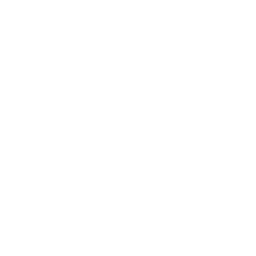

# 

###

- 💡  - Focused on building web and mobile apps.
- 👨‍💻  - Check out my latest personal project [E-Commerce Web App](https://e-commerce-app-git-main-jordanastons-projects.vercel.app/) 
- 💻  - Check out the projects I've been working on at [Labrys](https://labrys.io/) (2024/25) [Pegs (AUS)](https://www.localpegs.com.au/) 📱 [Repegs (USA)](https://www.repegs.com/) 📱 [Glue Network](https://www.glue.net/) 💻
- 💬  - Ask me about Next.js, React, React Native & Typescript
- 🌱  - Currently boosting my UI skills with [shadcn/ui](https://ui.shadcn.com/)
- 🌏  - Check out my portfolio [here](https://jordanaston.io/)

###

###

  
  
  
  
  
  
  
  
  
  
  
  
  
  
  
  
  
  
  
  
  
  
  
  
  
  
  
  
  
  
  
  
  
  
  

###

  
  
  

###

###

